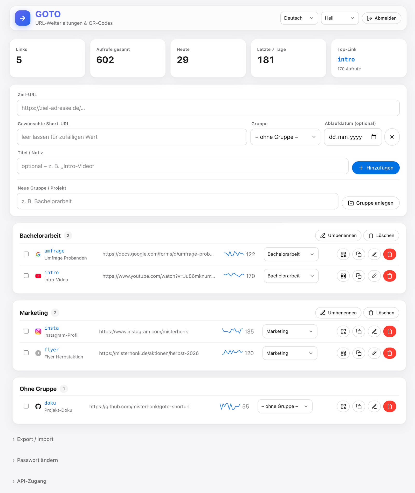

# GOTO — selbstgehosteter URL-Shortener & QR-Generator

Schlanker, datenbankloser Kurz-URL-Dienst in PHP. Verwaltet Weiterleitungen
(`deine-domain.de/goto/kürzel` → Ziel-URL), erzeugt QR-Codes lokal im Browser
und zählt Aufrufe DSGVO-konform — alles in ein paar Dateien, ohne Datenbank.



---

## Inhalt

- [Funktionen](#funktionen)
- [Aufbau & Dateien](#aufbau--dateien)
- [Installation](#installation)
- [Konfiguration](#konfiguration)
- [Serverkonfiguration (Apache / nginx / Caddy)](#serverkonfiguration-apache--nginx--caddy)
- [Bedienung](#bedienung)
- [API](#api)
- [Datenmodell](#datenmodell)
- [Sicherheit](#sicherheit)
- [Lokal testen (Docker)](#lokal-testen-docker)
- [Wartung & Fehlersuche](#wartung--fehlersuche)

---

## Funktionen

- **Kurz-URLs** mit eigenem Kürzel oder automatisch generiertem Zufalls-Slug
- **Gruppen / Projekte** zum Ordnen, inkl. Verschieben per Dropdown oder **Drag & Drop**
- **QR-Codes** pro Link — lokal erzeugt (kein externer Dienst), als **PNG oder SVG**,
  mit einstellbarer Fehlerkorrektur (L/M/Q/H), Größe, Rand, Farben und optionalem
  **Logo in der Mitte** (GOTO-Logo oder eigenes Bild; bleibt im Browser)
- **Klick-Zähler** — rein anonym (keine IPs, Zeitstempel oder User-Agents),
  mit **Gesamt-Statistik** über alle Links (Kachel anklicken) und
  **CSV-Export** der Tageswerte,
  mit **Statistik-Kacheln** (gesamt / heute / 7 Tage / Top-Link) und
  **Klick-Verlauf** als Diagramm (14 / 30 / 90 Tage)
- **Titel / Notiz** je Link, **Ablaufdatum** (abgelaufene Links liefern `410 Gone`)
- **Passwortgeschützte Links**: optional je Link ein Passwort – Besucher sehen
  erst eine Passwort-Seite, dann die Weiterleitung (bcrypt, mit Brute-Force-Sperre)
- **Vorschau-Zwischenseite** (opt-in je Link): zeigt Titel und Ziel-Domain,
  leitet nach 3 Sekunden automatisch weiter – praktisch für QR-Codes auf Print
- **Query-Parameter-Durchreichung**: `goto/kürzel?utm_source=flyer` hängt die
  Parameter an die Ziel-URL an – ein Kurzlink, Tracking pro Kanal
- **Tages-Backups**: automatisch beim ersten Speichern des Tages
  (`backups/`, 7 Generationen) zusätzlich zur `.bak`-Sicherung
- **Diagnose** im Admin: Ampel-Selbsttest (Schreibrechte, PHP, Rewrite,
  Dateischutz, HTTPS, Backups) – praktisch nach dem Deployment
- **Live-Suche**, **Bulk-Aktionen** (verschieben / löschen / Zähler zurücksetzen)
- **Import / Export** als JSON
- **HTTP-API** zum Anlegen von Links per Skript, abgesichert über **API-Token**
- **Social-Media-Vorschau**: beim Teilen eines Kurzlinks (WhatsApp, Slack, …)
  zeigt die Vorschau den **Titel aus dem Eintrag** samt GOTO-Vorschaubild
- **Favicon & Theme-Color** im Marken-Design, gestaltete 404/410-Seiten
- **Inline-Validierung** der URL, **Toast-Meldungen**
- **„Angemeldet bleiben"** (sichere Token)
- Modernes, responsives UI im **Apple-Look** (Glas-Topbar, Pill-Buttons,
  Hairlines) inkl. **Dark Mode**

---

## Aufbau & Dateien

| Datei | Zweck |
|---|---|
| `index.php` | Öffentliche Weiterleitung + Klick-Zähler + Ablauf-Prüfung |
| `admin.php` | Komplettes Admin-Interface und Verwaltungslogik |
| `api.php` | HTTP-API zum Anlegen von Kurz-URLs (Token-Auth) |
| `lib.php` | Gemeinsame Basis (Bootstrap, Datenmodell, Helfer) für die drei oben |
| `config.php` | Konfiguration (Passwort-Hash, Timeouts, Datenpfad) |
| `deploy.sh` | Baut einen vollständigen Upload-Satz in `dist/` *(nur Dev)* |
| `assets/` | Statisches Frontend: `goto.css`, `app.js`, `qr.js` (QR-Encoder), Icons (`favicon.svg`, `apple-touch-icon.png`, `og.png`) |
| `favicon.ico` | Fallback-Favicon für ältere Browser |
| `.htaccess` | URL-Rewriting + Schutz sensibler Dateien |
| `urls.json` | Datenbestand (Gruppen + Links) |
| `clicks.json` | Aufruf-Zähler *(wird automatisch angelegt)* |
| `.ht_attempts.json` | Login-Fehlversuche (Rate-Limiting) *(automatisch)* |
| `.ht_tokens.json` | „Angemeldet bleiben"-Token, nur gehasht *(automatisch)* |
| `.ht_apitokens.json` | API-Token, nur gehasht *(automatisch)* |
| `.ht_auth.json` | Passwort-Hash (vom Setup gesetzt) *(automatisch)* |

Es wird **keine Datenbank** benötigt — alle Daten liegen in JSON-Dateien.

---

## Installation

1. **Upload-Satz bauen:** `./deploy.sh` ausführen. Das legt lokal den Ordner
   `dist/` mit genau den benötigten Dateien an (Anwendungscode, `lib.php`,
   Unterordner `assets/`, `.htaccess`; Dev- und Laufzeitdateien bleiben außen vor).
2. **Den *Inhalt* von `dist/`** per FTP/SSH in den Web-Root laden – also direkt
   `index.php`, `admin.php`, …, **inklusive des Unterordners `assets/`**
   (Pfad frei wählbar; Beispiele hier nutzen `/goto/`). Auf dem Server liegt
   **kein** `dist/`-Ordner, sondern dessen Inhalt. Bei Erstinstallation
   `urls.example.json` dort in `urls.json` umbenennen.
   *(Ohne `deploy.sh` geht es auch manuell – dann unbedingt `lib.php` und den
   Ordner `assets/` mit hochladen.)*
3. Sicherstellen, dass der Zielordner für den Webserver **beschreibbar** ist
   (für `urls.json`, `clicks.json` usw.):
   ```bash
   chmod 664 urls.json
   chmod 775 .          # falls der Webserver Dateien anlegen muss
   ```
4. Im Browser `deine-domain.de/goto/admin` öffnen → **Setup-Bildschirm**
   erscheint (siehe [Konfiguration](#konfiguration)).
   (`admin.php` leitet automatisch auf die saubere URL `/admin` um.)

**Voraussetzungen:** PHP 8.0+ mit aktiviertem `mod_rewrite` (Apache).
Ohne `mod_rewrite` funktionieren Links in der Form
`…/goto/index.php?slug=kürzel`.

---

## Konfiguration

Alle Einstellungen in `config.php`:

```php
return [
    'password_hash'   => '',      // bcrypt-Hash (siehe Setup) oder leer = Setup
    'idle_timeout'    => 1800,    // Auto-Logout nach Inaktivität (Sekunden)
    'max_attempts'    => 5,       // Login-Fehlversuche bis zur Sperre
    'lockout_seconds' => 900,     // Sperrdauer nach zu vielen Versuchen
    'data_dir'        => __DIR__, // Speicherort der Datendateien
];
```

### Passwort setzen (Ersteinrichtung)

Beim ersten Aufruf von `admin.php` erscheint ein **Setup-Bildschirm**:
einfach Wunschpasswort eingeben → es wird sicher (bcrypt) gespeichert
(in `.ht_auth.json` im Datenverzeichnis) → fertig, direkt anmelden.
Kein Datei-Editieren nötig.

Später im Admin unter **„Passwort ändern"** jederzeit änderbar.

**Optional** lässt sich der Hash stattdessen fest in `config.php` oder per
Umgebungsvariable `GOTO_PASSWORD_HASH` „festnageln" (hat Vorrang und deaktiviert
das Ändern im UI) — praktisch für Container-Deployments:
```bash
php -r "echo password_hash('MEIN_PASSWORT', PASSWORD_DEFAULT), PHP_EOL;"
```

> Voraussetzung fürs automatische Speichern: Das Datenverzeichnis muss
> beschreibbar sein. Andernfalls zeigt das Setup als Fallback die Zeile zum
> manuellen Eintragen in `config.php`.

### Datenverzeichnis verschieben (empfohlen)

Für maximale Sicherheit die Datendateien **außerhalb des Web-Roots** ablegen,
dann sind sie unabhängig von Apache/`.htaccess` nicht abrufbar:

```php
'data_dir' => __DIR__ . '/../goto-data',
```

Den Ordner anlegen, beschreibbar machen und vorhandene `urls.json` dorthin
verschieben. `index.php` und `admin.php` nutzen automatisch denselben Pfad.

---

## Serverkonfiguration (Apache / nginx / Caddy)

GOTO braucht vom Webserver drei Dinge: unbekannte Pfade (= Kürzel) an
`index.php` leiten, `/admin` auf `admin.php` abbilden und die Datendateien
sperren. Alle drei Varianten sind **getestet** (die Docker-Testumgebung fährt
sie gegen dieselben Beispieldateien hoch, siehe `docker-compose.yml`):

| Server | Konfiguration | Hinweise |
|---|---|---|
| **Apache** | `.htaccess` (liegt bei) | Standard; läuft auf Shared-Hosting inkl. IONOS. `FallbackResource`-Pfad an den Ordner anpassen. |
| **nginx** | [`docs/nginx.example.conf`](docs/nginx.example.conf) | `$is_args$args` im `try_files`-Fallback nicht weglassen (sonst gehen Query-Parameter verloren); bei HTTPS `fastcgi_param HTTPS on;` aktivieren. |
| **Caddy** | [`docs/Caddyfile.example`](docs/Caddyfile.example) | Kürzeste Variante, automatisches HTTPS inklusive. FPM-Adresse per `GOTO_FPM`-Umgebungsvariable überschreibbar. |

Unter nginx und Caddy kommen `Authorization`-Header (API) und
Query-Parameter ohne Zusatzkonfiguration an. **Abnahme-Test nach dem
Einrichten:** Admin → **Diagnose** öffnen – die Ampel prüft Rewriting und
Dateischutz direkt im Browser.

Zum lokalen Testen der Beispiel-Configs:
```bash
docker compose --profile servers up -d
# nginx: http://localhost:8089/goto/admin   Caddy: http://localhost:8090/goto/admin
```

---

## Bedienung

Admin-Oberfläche: `deine-domain.de/goto/admin`

- **Link anlegen:** Ziel-URL eingeben → *Hinzufügen* (leer = zufälliges
  6-Zeichen-Kürzel). Unter **„Weitere Optionen"** (aufklappbar, Zustand wird
  gemerkt): Wunsch-Kürzel, Gruppe, Ablaufdatum, Titel/Notiz, Link-Passwort,
  Vorschau-Seite sowie das Anlegen neuer Gruppen.
- **Vorschau-Seite:** mit Häkchen „Vorschau-Seite vor der Weiterleitung" sehen
  Besucher erst Titel + Ziel-Domain und werden nach 3 Sekunden (oder per
  Klick) weitergeleitet.
- **QR-Code:** QR-Symbol in der Zeile öffnet den Dialog mit Vorschau,
  Einstellungen und PNG-/SVG-Download.
- **Verschieben:** per Gruppen-Dropdown oder Drag & Drop auf eine Gruppe.
- **Suche:** Feld über der Liste filtert live nach Kürzel, Titel, URL, Gruppe.
- **Mehrfachauswahl:** Checkboxen markieren → verschieben / löschen /
  Zähler zurücksetzen.
- **Passwortschutz:** beim Anlegen oder Bearbeiten ein Link-Passwort setzen →
  Besucher sehen erst eine Passwort-Seite (Titel des Eintrags, GOTO-Look) und
  gelangen nach korrekter Eingabe zum Ziel. Gespeichert wird nur der
  bcrypt-Hash; nach 8 Fehlversuchen greift eine 15-Minuten-Sperre je Besucher.
  Die Ziel-URL wird vor der Freigabe nirgends verraten (auch nicht an
  Social-Media-Crawler). Klicks zählen erst nach erfolgreicher Eingabe.
- **Export/Import:** unter „Export / Import" (JSON). Beim Import wahlweise
  ersetzen oder zusammenführen; Klick-Zähler werden nicht exportiert.

Öffentlicher Link-Aufbau: `deine-domain.de/goto/kürzel`

### Link-Vorschau beim Teilen

Wird ein Kurzlink in WhatsApp, Slack, Telegram & Co. geteilt, zeigt die
Vorschau **Titel des Eintrags**, Ziel-Host und ein GOTO-Vorschaubild.
Technisch: Preview-Crawler werden am User-Agent erkannt und bekommen eine
kleine Open-Graph-Seite statt der Weiterleitung; normale Besucher erhalten
weiterhin sofort das 302. Bot-Aufrufe zählen dabei **nicht** als Klick.

> Hinweis: Der Link-**Titel wird dadurch öffentlich sichtbar** (für jeden, der
> den Kurzlink kennt). Interne Notizen also besser nicht ins Titel-Feld.

---

## API

Kurz-URLs lassen sich auch per HTTP-Schnittstelle anlegen — praktisch für
Skripte oder andere Tools.

**Token erstellen:** im Admin unter **„API-Zugang"** einen Token mit Namen
anlegen. Der Token wird **nur einmalig** im Klartext angezeigt (serverseitig
liegt nur ein SHA-256-Hash) — also gleich sicher notieren. Nicht mehr
benötigte Token jederzeit **widerrufen**.

**Endpoint:** `deine-domain.de/goto/api.php`
**Authentifizierung:** `Authorization: Bearer goto_…`
(alternativ Header `X-Api-Key:` oder Feld `token=`).
Daten als Formularfelder, JSON-Body (`Content-Type: application/json`)
oder Query-Parameter.

| Methode | Zweck |
|---|---|
| `GET` | Liste aller Links (inkl. Klick-Summen und Gruppen) |
| `GET ?slug=…` | Details eines Links inkl. `clicks_today` und Tageswerten (`clicks_days`) |
| `POST` | Link anlegen |
| `PATCH` | Link ändern (`slug` = Kennung; nur übergebene Felder werden geändert) |
| `DELETE ?slug=…` | Link in den Papierkorb (Wiederherstellen im Admin möglich) |

Felder für `POST`/`PATCH`:

| Feld | POST | Beschreibung |
|---|---|---|
| `url` | Pflicht | Ziel-URL (`http`/`https`) |
| `slug` | – | Wunsch-Kürzel; leer = zufällig (bei `PATCH`: Pflicht, als Kennung) |
| `newslug` | – | nur `PATCH`: Kürzel umbenennen (Klick-Zähler wandert mit) |
| `group` | – | Gruppe (wird bei Bedarf angelegt) |
| `title` | – | Titel / Notiz |
| `expires` | – | Ablaufdatum `JJJJ-MM-TT` (leer = kein Ablauf) |
| `password` | – | Link-Passwort (nur Hash gespeichert; bei `PATCH`: `""` entfernt es) |
| `preview` | – | `1`/`true` = Vorschau-Zwischenseite vor der Weiterleitung |

```bash
# Anlegen
curl -X POST https://deine-domain.de/goto/api.php \
  -H "Authorization: Bearer goto_…" \
  -d "url=https://ziel-adresse.de/lange/seite" -d "slug=mein-kuerzel"

# Liste mit Klickzahlen / Details mit Tageswerten
curl -H "Authorization: Bearer goto_…" https://deine-domain.de/goto/api.php
curl -H "Authorization: Bearer goto_…" "https://deine-domain.de/goto/api.php?slug=mein-kuerzel"

# Ändern (nur die übergebenen Felder)
curl -X PATCH https://deine-domain.de/goto/api.php \
  -H "Authorization: Bearer goto_…" \
  -d "slug=mein-kuerzel" -d "title=Neuer Titel" -d "expires=2027-01-01"

# Löschen (in den Papierkorb)
curl -X DELETE -H "Authorization: Bearer goto_…" \
  "https://deine-domain.de/goto/api.php?slug=mein-kuerzel"
```

Antworten sind JSON: Erfolg `{ "ok": true, … }` (Anlegen: `201`, sonst `200`);
Link-Objekte enthalten `slug`, `short_url`, `url`, `group`, `title`, `expires`,
`created`, `protected`, `preview`, `clicks` – Passwort-Hashes werden **nie**
ausgegeben. Fehler liefern passenden Status + `{ "ok": false, "error": "…" }`:
`401` (Token), `404` (Kürzel unbekannt), `422` (URL/Kürzel ungültig),
`409` (Kürzel vergeben oder reserviert), `429` (Rate-Limit, **120
Anfragen/Min.** je Token), `405` (Methode).

> Auf manchen Hostern (CGI/FPM) wird der `Authorization`-Header entfernt; die
> mitgelieferte `.htaccess` reicht ihn an PHP durch. Klappt das nicht, den
> Token als Header `X-Api-Key:` oder Feld `token=` senden.

---

## Datenmodell

`urls.json`:

```json
{
  "groups": ["Bachelorarbeit"],
  "links": {
    "intro": {
      "url": "https://www.youtube.com/watch?v=…",
      "group": "Bachelorarbeit",
      "title": "Intro-Video",
      "expires": "2026-12-31",
      "created": 1781695468,
      "pass": ""
    }
  }
}
```

`clicks.json` — nur Zähler, sonst nichts:

```json
{ "intro": 42 }
```

> Hinweis: Das alte flache Format `{ "kürzel": "url" }` wird weiterhin gelesen
> und beim ersten Speichern automatisch ins neue Format überführt.

---

## Sicherheit

- **Passwörter** nur als **bcrypt-Hash** (`password_hash`/`password_verify`)
- **Zwei-Faktor-Authentifizierung (TOTP)** optional fürs Admin: Einmal-Codes aus
  einer Authenticator-App, komplett offline (Secret in `.ht_auth.json`).
  „Angemeldet bleiben"-Geräte überspringen die Abfrage. *Notfall (App verloren):*
  in `.ht_auth.json` den Eintrag `"totp"` entfernen (z. B. per FTP)
- **CSRF-Schutz** auf allen schreibenden Aktionen (`hash_equals`)
- **Brute-Force-Bremse**: Sperre nach `max_attempts`, IP nur gehasht gespeichert
- **Session-Härtung**: `HttpOnly`, `SameSite=Strict`, `Secure` (bei HTTPS),
  `session_regenerate_id` gegen Session-Fixation, Idle-Timeout
- **„Angemeldet bleiben"**: Selector\:Validator-Token, serverseitig nur als
  Hash gespeichert, bei jeder Nutzung rotiert, beim Logout gelöscht
- **API-Token**: serverseitig nur als SHA-256-Hash gespeichert, einmalig im
  Klartext angezeigt, jederzeit widerrufbar, eigenes Rate-Limit je Token
- **Content-Security-Policy** (Nonce-basiert, kein `unsafe-inline`) plus
  `X-Frame-Options`, `X-Content-Type-Options`, `Referrer-Policy`, **HSTS** –
  auf dem Admin **und** allen öffentlichen Seiten (Passwort-/Vorschau-/
  Fehlerseite), u. a. als Clickjacking-Schutz der Passwort-Seite
- **Gehärtete Sessions:** `session.use_strict_mode` (keine untergeschobenen
  Session-IDs) und `use_only_cookies` explizit aktiviert
- **Ersteinrichtung:** setze das Passwort **sofort** nach dem Upload – bis dahin
  könnte jede Person mit der Adresse es festlegen. Für heikle Umgebungen den
  Hash vorab per `GOTO_PASSWORD_HASH` bzw. `config.php` setzen
- **URL-Validierung**: nur `http`/`https` werden gespeichert und weitergeleitet
  (auch in `index.php` erneut geprüft)
- **Dateischutz**: `.htaccess` sperrt `*.json`, `config.php` und Dotfiles;
  `display_errors` ist deaktiviert

Mehr zum optionalen Auslagern der Daten unter
[Datenverzeichnis verschieben](#datenverzeichnis-verschieben-empfohlen).

---

## Lokal testen (Docker)

Im übergeordneten Ordner liegen `Dockerfile`, `docker-compose.yml` und eine
Anleitung (`README-docker.md`):

```bash
docker compose up -d --build
# -> http://localhost:8088/goto/admin
```

Bildet PHP 8.2 + Apache mit `mod_rewrite` ab (wie typisches Shared-Hosting).
Diese Dateien liegen **außerhalb** von `goto/` und gehören **nicht** zum
Produktiv-Upload.

---

## Wartung & Fehlersuche

| Problem | Ursache / Lösung |
|---|---|
| „Konnte nicht speichern" | Schreibrechte auf `urls.json` bzw. `data_dir` prüfen |
| `500`-Fehler nach Upload | evtl. `Options -Indexes` in `.htaccess` nicht erlaubt → Zeile entfernen |
| Weiterleitung 404 statt Ziel | Kürzel existiert nicht oder `mod_rewrite` fehlt |
| Link liefert `410` | Ablaufdatum überschritten — im Admin anpassen/entfernen |
| QR-Code zu „voll" | längere URLs → kürzeres Kürzel oder Fehlerkorrektur senken |
| Favicons fehlen | werden von `icons.duckduckgo.com` geladen; bei Blockade einfach ignorierbar |

Backups: GOTO legt beim ersten Speichern eines Tages automatisch eine Kopie
unter `backups/urls-JJJJ-MM-TT.json` an (die letzten 7 Tage bleiben erhalten),
zusätzlich zur `urls.json.bak` bei jedem Schreibvorgang. Für externe Sicherungen
einfach `urls.json` kopieren oder die Export-Funktion nutzen.

Nach einem Deployment lohnt ein Blick in **Admin → Diagnose**: prüft
Schreibrechte, PHP-Version, `mbstring`, Dateischutz per `.htaccess`,
URL-Rewriting, HTTPS und den Backup-Stand mit grün/roter Ampel.

---

*Erstellt mit Claude Code.*
